# Laravel Actions and Services

Honestly, organizing business logic in Laravel sometimes feels like herding cats.
Controllers, jobs, events—everyone's fighting for attention, and before you know it, you’ve got a mess that’s one step
away from spaghetti code.
In my projects, I use **Actions** and **Services** to bring structure and clarity. This is an **opinionated guideline**,
based on how my team works-not a universal rulebook.
Yeah, Actions aren’t exactly revolutionary - they’re basically the Command pattern rebranded.
And no, I'm not trying to cosplay as Domain-Driven Design purists.
It's simply a focused, practical approach to organizing business logic in Laravel.

<details>
<summary><strong>TL;DR – Quick Summary</strong></summary>

- **Actions**: Handle full business operations (checkout, registration, import)
- **Services**: Reusable, stateless logic (calculation, validation, formatting, API calls, you get it)
- Naming: Keep it obvious: `OrderCreateAction`, `DeliveryScheduleService` without cryptic nonsense
- Controllers should be on a diet; send that logic to Actions and Services
- DTOs make your data flow squeaky clean and testable

</details>

## Why Actions and Services?

Okay, so here's the deal-Laravel is super flexible.
Like, to the point where you could toss your business logic just about anywhere and nobody would blink... until your
project turns into a spaghetti monster.
Joel Clermont totally nails this in *Where should you put your business logic?*-it's a blessing and a curse.
My take? Split your logic into Actions (for the big-picture stuff) and Services (for the repeatable, "stateless" bits).
This isn't just some random idea-Nuno Maduro's all about it in *Laravel Actions: The Secret Sauce*.
Actions are context-free; doesn't matter if you're hitting HTTP, console, or some background job, the
code stays consistent.
Super handy and ensuring consistency as teams scale.

Need a cheat sheet for where logic belongs? Here's a quick flowchart to keep you from losing your mind:



## Actions: Focused Business Operations

Actions are single-purpose classes that handle complete business operations.
Want to create an order? Log a search query? That's an Action's jam.
Think Command pattern vibes: it wraps up a job with a clear "start here, end there" boundary.

### Action Guidelines

- **When to Use**: If your logic messes with the world (sends a notification, runs a transaction, or handles a
  user-triggered thing like `OrderCreateAction` or `CartItemAddAction`), put it in an Action.
- **Naming**: Don't overthink it-stick to `[Domain][Object][Verb]Action` (like `OrderItemCancelAction` or
  `SearchQueryTrackLogAction`). This ensures clarity, as Nabil Hassen emphasizes in *Action Pattern in Laravel*.
- **Structure**: Dump Actions in `app/Actions/[Domain]` (say, `app/Actions/Order`). The main entry point? `handle()`.
  Like so:

  ```php
  namespace App\Actions\Order;

  use App\DataTransferObjects\OrderCreateDTO;
  use App\Models\Order;
  use App\Repositories\OrderRepository;
  use App\Services\OrderConditionService;
  use App\Actions\OrderIssueNotificationAction;
  use Illuminate\Support\Facades\DB;

  final class OrderCreateAction
  {
      public function __construct(
          private readonly OrderRepository $orderRepository,
          private readonly OrderConditionService $orderConditionService,
          private readonly OrderIssueNotificationAction $notificationAction
      ) {}

      public function handle(OrderCreateDTO $dto, int $userId): Order
      {
          $this->orderConditionService->validate($dto);
          return DB::transaction(function () use ($dto, $userId) {
              $order = $this->orderRepository->create($dto, $userId);
              $this->notificationAction->handle($order);
              return $order;
          });
      }
  }
  ```

- **Best Practices**:
    - One job, one Action. Don't mash up ten things.
    - Constructor-inject your dependencies (services, repos, other Actions, etc).
    - Wrap stuff in `DB::transaction()` for atomicity, as Nuno Maduro suggests in *Actions in Laravel Cloud*.
    - Let business exceptions bubble up-let the global handler resolve the details.
    - Return affected resource or nothing.

Actions are killer for choreographing business logic: like having `OrderCreateAction` tap `OrderIssueNotificationAction`
on the shoulder when it's done.
Keeps your code tidy, modular, and super easy to test. No more spaghetti.

## Services: Reusable Business Logic

Alright, let's talk services.
Basically, these are your go-to spots for logic you need all over the place-stuff like calculations, API calls...that
sort of thing. They’re not meant to run the whole show (leave that to your Actions), but if you find yourself
copy-pasting the same logic more than once, that’s your cue to extract a Service.

Here's the thing: if you start cramming every random utility into one mega-service, congrats, you've built a monster
nobody wants to debug.
Keep it lean, keep it mean, and you'll thank yourself later.

### Service Guidelines

- **When to Use**: For reusable logic (e.g., `DeliveryScheduleService`), validations (e.g., `CartItemValidator`), or
  integrations (e.g., `TehnomirApi`).
- **Naming**: Stick to `[Domain][Purpose]Service` (e.g., `SearchResultService`, `RequestReturnQuantityValidator`).
  If you need to toss in a `Validator` or `Api` at the end, go for it. Just don't get too wild.
- **Where It Lives**: Place in `app/Services/[Domain]` (e.g., `app/Services/Cart`). Methods should be laser-focused and
  stateless.
  Here's a quick sample:

  ```php
  namespace App\Services\Supplier;

  use DateTime;

  final class DeliveryScheduleService
  {
      public function calculateSchedule(DateTime $orderDate, array $supplierRules): DateTime
      {
          // Just calculates the delivery schedule, nothing magical
          return $this->applySupplierRules($orderDate, $supplierRules);
      }

      private function applySupplierRules(DateTime $orderDate, array $rules): DateTime
      {
          // Don't overthink this, just a placeholder
          return $orderDate;
      }
  }
  ```

- **Best Practices**:
    - Stateless. Pure functions. No side effects, please.
    - If it's depending on more than 4-5 other Services, you're probably doing too much..
    - Design for reuse across Actions or contexts.
    - You should be able to write a unit test for it without wanting to throw your laptop out the window.

In short: Services are your go-to for validating cart items, normalizing data, figuring out delivery dates, formatting
API payloads, and messing with third-party systems. They provide reusable building blocks for Actions and keep your
codebase modular and testable.

## Organizing and Composing

### Directory Structure

Organize by domain for scalability, as shown in the guideline:

```
app/
├── Actions/
│   ├── Order/
│   │   ├── OrderCreateAction.php
│   │   └── OrderItem/
│   │       ├── OrderItemCancelAction.php
│   ├── Search/
│   │   ├── SearchQueryTrackLogAction.php
├── Services/
│   ├── Order/
│   │   ├── OrderConditionService.php
│   ├── Supplier/
│   │   ├── DeliveryScheduleService.php
```

Not rocket science, but trust me-future you will thank present you for this.

### Action Composition

Actions can depend on Services and sub-Actions (up to 5-8 dependencies) to orchestrate workflows. Avoid deep chains and
limit to one transaction per Action. For example, `OrderCreateAction` uses `OrderConditionService` and
`OrderIssueNotificationAction`.

### Slicing Up Actions

If one Action starts acting like it's the main character, split it up.
Stuff trying to do too much? Break it down.
But dont create action for every tiny task - use them for meaningful operations to avoid unnecessary complexity.
Instead of an overloaded `OrderProcessAction`, just make
`OrderCreateAction`, `OrderPaymentProcessAction`, and `OrderInventoryUpdateAction`.
Each one with a clear, single job. No drama, no confusion.

## Controller Integration

Controllers? Yeah, keep 'em skinny. None of that bloated logic soup-just pass the heavy lifting to Actions.
Got Form Requests, DTOs, API Resources? Use 'em. Check out this snippet:

  ```php
  namespace App\Http\Controllers\Customer\Order;

  use App\Actions\Customer\Order\OrderCreateAction;
  use App\DataTransferObjects\Customer\Order\OrderCreateDTO;
  use App\Http\Controllers\Controller;
  use App\Http\Requests\Customer\Order\OrderStoreRequest;
  use App\Http\Resources\Customer\Order\OrderResource;
  use App\Repositories\User\CurrentAuthUserRepository;

  final class OrderController extends Controller
  {
      public function store(
          OrderStoreRequest $request,
          CurrentAuthUserRepository $currentAuthUserRepository,
          OrderCreateAction $orderCreateAction
      ): OrderResource
      {
          $user = $currentAuthUserRepository->getApiCustomerUser();
          $validatedInput = $request->safe();
          $orderCreateDTO = new OrderCreateDTO(
              ip: $request->ip(),
              userAgent: $request->userAgent(),
              items: $validatedInput->input('items'),
              directionTypeId: $validatedInput->input('direction_type_id')
          );
          $order = $orderCreateAction->handle($orderCreateDTO, $user->id);
          return OrderResource::make($order);
      }
  }
  ```

Bare minimum in the controller-just enough to grab what you need, toss it to an Action, and wrap up the response.
No one wants to scroll through a controller that looks like War and Peace.

Oh, and those exceptions like `UserCheckException`? Actions throw them, and some global handler swoops in to catch them
and spit out a tidy JSON error.
You don't need to clutter up your controller with try/catch gymnastics-just let the framework do its thing.

## Why This Approach?

This approach has brought consistency to my Laravel projects.
Nuno Maduro dropped some gems in *Actions in Laravel Cloud* about how keeping things uniform makes it way less painful
to get new folks up to speed-or just to remember what the heck you wrote three months ago. Actions handle operations
with side effects, while Services provide reusable utilities. This isn't DDD-it's just a pragmatic setup, tailored for
clarity and scalability.

## Best Practices

- **Actions**: Do one thing, have a `handle()` method, use transactions when you need 'em, keep it type-safe, exception
  bubbling.
- **Services**: Stateless, pure functions, focused interfaces, reusable across Actions.
- **Folders & Naming**: Group stuff by what it does (the "domain"), and name it so you instantly know what's up:
  `[Domain][Object][Verb]Action`, `[Domain][Purpose]Service`.
- **Composition**: Limit Action dependencies to 5-8, Service dependencies to 4-5, avoid deep Action chains.
- **Controllers**: Keep thin, use Form Requests, DTOs, and API Resources.

## Wrapping Up

Actions and Services have streamlined my Laravel development, balancing simplicity and scalability. Actions encapsulate
operations, while Services provide reusable logic, creating a maintainable codebase.
Yeah, it's an "opinionated" approach, but it works for my crew.
It's opinionated, sure-but it works for my crew.
Take it, tweak it, or toss it, whatever fits your vibe. Check the full guidelines
on [GitHub](https://github.com/tegos/laravel-action-and-service-guideline). Give it a try on your next Laravel project.
Drop your hot takes in the comments!
