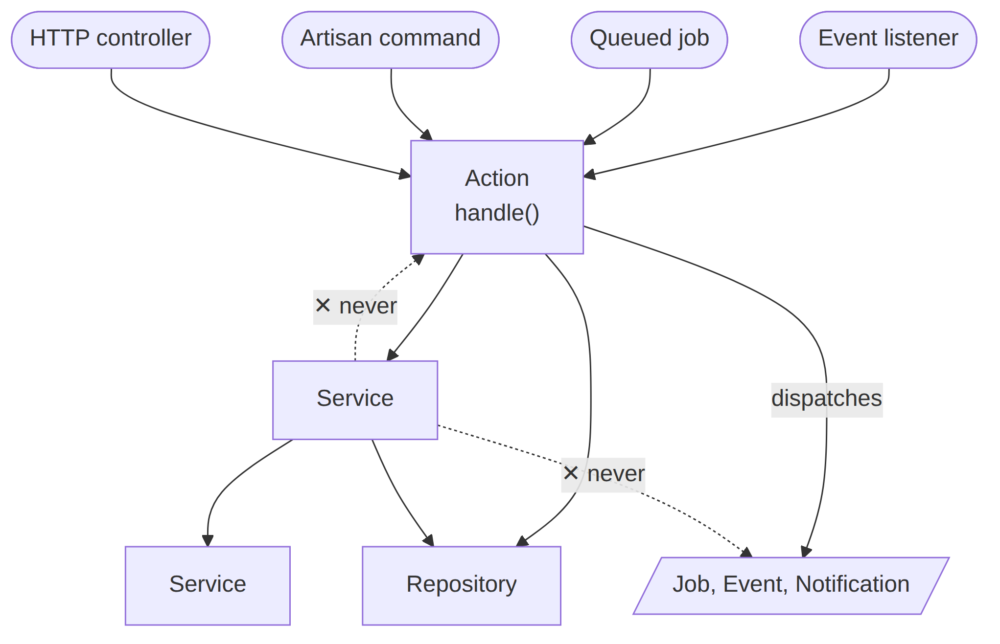

# Laravel Action and Service Guideline

Reference for structuring business logic in Laravel with the Action + Service pattern.

The companion article [Laravel Actions and Services](https://dev.to/tegos/laravel-actions-and-services-360d) explains the why; this document is the what and how.

<!--
  assets/call-direction.png is generated, not authored. The source of truth is the
  mermaid fence in action-and-service-guidelines.md. After editing that fence, regenerate:

    npx @mermaid-js/mermaid-cli -i action-and-service-guidelines.md -o assets/call-direction.png -b white -s 3

  (mmdc writes call-direction-1.png; rename it.) The PNG exists because dev.to renders
  neither mermaid fences nor repo-relative paths, so the article hot-links this file.
-->

## What's Here

- Decision rules: Action vs Service, with a quick-check list
- Naming conventions: `[Domain][Object][Verb]Action`, `[Domain][Purpose]Service`
- Method signatures, constructor rules, return types
- Composition patterns and real class examples
- Edge cases: repositories, DTOs, exceptions, job dispatching
- When not to use this pattern

## Read the Guideline

[action-and-service-guidelines.md](action-and-service-guidelines.md)

## License

MIT
