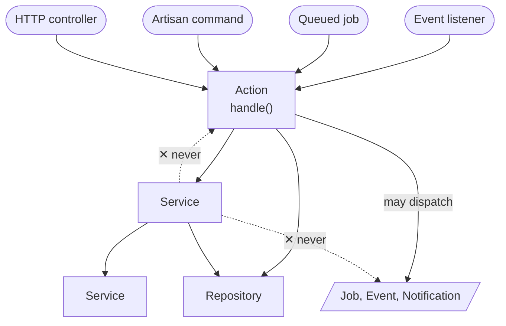

# Action and Service Guidelines with Naming Conventions

> Companion article: [Laravel Actions and Services](https://dev.to/tegos/laravel-actions-and-services-360d) - the why behind this reference; this document is the what and how.

## Overview

This guideline defines when to use **Actions** and **Services** in a Laravel application, provides naming conventions,
and outlines practices for organizing and implementing them. The goal is consistency, maintainability, and a codebase
where any developer can predict where a piece of logic lives and how it is invoked.

## Contents

- [The Core Rule: Direction Decides It](#the-core-rule-direction-decides-it)
- [What a Service Actually Is](#what-a-service-actually-is)
- [When to Use Actions and Services](#when-to-use-actions-and-services)
- [Action Naming Conventions](#action-naming-conventions)
- [Service Naming Conventions](#service-naming-conventions)
- [Class Declaration Conventions](#class-declaration-conventions)
- [File Organization](#file-organization)
- [Practices](#practices)
- [Quick Decision: Action or Service?](#quick-decision-action-or-service)
- [Repositories](#repositories)
- [DTOs](#dtos)
- [Action Composition and Splitting](#action-composition-and-splitting)
- [Typical Laravel Controller Integration](#typical-laravel-controller-integration)
- [Testing](#testing)

## The Core Rule: Direction Decides It

Before any checklist or matrix, there is one rule that the codebase actually obeys:

- **An Action is an entry point.** It is the unit a controller, console command, queued job, or event handler invokes
  to run one complete operation. Its main entry method is `handle()`.
- **A Service is a collaborator.** It is invoked **by** Actions (or by other Services, occasionally by a thin
  controller) to do one focused piece of work: calculate, validate, transform, format, or wrap a single external call.
- **Direction decides it.** Outside code triggers it as a whole operation, it is an Action. Other code reaches into it
  mid-operation, it is a Service. The normal wiring is `controller -> Action -> Services`.

### The one hard invariant

**Services never call Actions, and never dispatch jobs or events.** This is the single guarantee the codebase
enforces (verified: zero references to the `App\Actions` namespace and zero `dispatch(` calls under `app/Services`).
If a class needs to trigger another business operation, fire a notification, or dispatch a job/event, it is an Action,
not a Service. Everything else below is guidance; this one is a rule.



*Calls run one way: any entry point into an Action, the Action down into Services and Repositories. Only the Action
dispatches. Nothing calls back up. The Action usually owns the transaction, though a self-contained Service invoked
top-level may own its own. The seams the diagram leaves out - an integration Repository that dispatches, a thin
controller read that skips the Action - are covered in the sections below.*

The reason is not testability - Laravel's `Queue::fake()` / `Event::fake()` make dispatching code easy to test. It is
that orchestration stays legible when it lives in one layer: read any Action and you see the whole operation, including
what it fires; Services stay predictable because they only ever compute and return. So return a value from the Service
and let the Action decide what to dispatch next. (One seam: an integration Repository that syncs external data may
dispatch a tracking job - see [Repositories](#repositories). That is the narrow exception, and such classes live under
`app/Repositories`, which is why the `app/Services` grep stays clean.)

You can enforce the namespace half with a Pest architecture test:

```php
expect('App\Services')->not->toUse('App\Actions');
```

This catches namespace violations before they reach code review. The no-dispatch half is not expressible as a
`toUse` rule - it stays a convention checked in review, backed by the `dispatch(` grep above. (The snippet needs
`pestphp/pest` with `pestphp/pest-plugin-arch`; on a PHPUnit-only suite, express the same rule with your
architecture-testing tool of choice.)

This invariant covers domain events and jobs that kick off downstream workflows. Framework-level lifecycle events -
model observers, Eloquent events fired inside a model - are a separate concern.

## What a Service Actually Is

A Service in this codebase is **a non-Action, non-Controller collaborator under `app/Services`**. In practice it spans
several shapes, and most are not pure or stateless. Be honest about this so the guidance matches reality:

- **Pure calculators / transformers** (e.g. `CartService`, `SupplierDisplayQuantityService`). The smallest, most
  testable group.
- **Validators** (e.g. `CartItemValidator`, `OrderCourierDateValidator`). Return `void`, throw on failure. Some are
  pure; some read the DB. A DB-reading validator is still a Service.
- **External API clients** (e.g. `SupplierApi`, `NovaPoshtaApi`). Heavy IO: HTTP calls, credentials, caching, stats
  increments, exception reporting.
- **DB-backed orchestrators / collectors** (e.g. `ProductSearchService`, `SupplierService`). If any of these have their
  own controller or command entry point, they are likely Actions, not Services - check the direction rule.
- **Cache / infra helpers** (e.g. `SearchArticleCacheService`, `GeoIpService`).

**Prefer stateless, side-effect-free Services where you can** - the pure calculators are the easiest to test and
reuse. But IO-heavy Services are fine and normal. A Service may freely do DB reads/writes, HTTP, cache, filesystem,
logging, or external AI calls. What it must never do is orchestrate a full operation by calling Actions or dispatching
jobs/events. That is the line, not purity.

### A note on state and input mutation

- **Prefer no instance state.** Most calculators are stateless. But some infra Services legitimately hold state:
  `SupplierApi` carries a mutable `$cacheEnabled` flag with fluent `enableCache()` / `disableCache()` toggles,
  `HttpClientLogBuffer` holds a `static array $entries` flushed to the DB, `CalculationLoggerService` accumulates
  `$loggedKeys` across calls. These are acceptable for infrastructure concerns.
- **Distinguish "no instance state" from "no input mutation."** Mutating a DTO argument in place is a separate, more
  surprising side effect. `SupplierDisplayQuantityService` currently sets `detailSupplierDTO->displayQuantity` on the
  argument it receives. Prefer returning new values over mutating passed DTOs, and keep DTOs read-only inside Services
  where practical.

## When to Use Actions and Services

### Use Actions When:

- **Complete business operations** with clear start/end boundaries (e.g. creating an order, canceling an item).
- **Command-like operations** triggered by a user action or system event (e.g. user login, search query logging).
- **Orchestrating multiple services or sub-actions** toward a business goal (e.g. processing a search with filters
  and sorting).
- **Transactional workflows** requiring atomicity (e.g. creating an order inside a DB transaction).
- **Operations that dispatch** notifications, jobs, or events, or that own the transaction. Dispatch is a one-way
  tell: present, it means Action; absent, it tells you nothing, since most Actions orchestrate without dispatching.
- **Complex multi-step business processes** (e.g. a cart checkout).

**Examples:**

```php
OrderCreateAction                     // Creates an order across multiple steps
SearchAction                          // Orchestrates search with filtering and sorting
CartItemStoreAction                   // Stores an item in the cart
CommunicationCloseConversationAction  // Closes a user conversation
PriceExportDownloadAction             // Downloads exported price data
```

### Use Services When:

- **Reusable business logic** used across multiple actions or contexts (e.g. calculating delivery schedules).
- **Domain-specific calculations or transformations** (e.g. normalizing part names).
- **Validation** of input or state (e.g. validating cart items). May be pure or DB-backed.
- **Data processing or formatting** (e.g. transforming search results).
- **Wrapping a single external call** (e.g. one API client per upstream system).
- **Focused infrastructure** like cache helpers or ID generators.

Note: a side effect alone does not make something an Action. A Service may do IO (DB, HTTP, cache, files, logs). What
makes a class an Action is dispatching a job/event, sending notifications, or owning the transaction. `SupplierApi`
does heavy IO and is still a Service, because it wraps one upstream and never orchestrates or dispatches.

**Examples:**

```php
CartItemValidator                   // Validates cart items (pure)
OrderCourierDateValidator           // Validates courier dates (reads the DB - still a Service)
DeliveryScheduleService             // Calculates delivery dates from supplier rules
SearchResultService                 // Processes search results
SupplierApi                         // Wraps one external API
PartNameNormalizerAI                // Normalizes part names via an external AI call
```

### The wrapper-vs-orchestrator split

This is the distinction that actually separates an API Service from an Action that uses APIs:

- **Wraps a single external call** -> Service: `SupplierApi`, `OeCatalogApi`, `GeoIpService`.
- **Orchestrates an end-to-end external operation** built from those wrappers -> Action: `VehicleFindByVinAction`
  (calls several API clients, normalizes, caches, returns a result for the controller).

### When not to bother

Not every operation earns an Action. Reach for one when the operation **owns a transaction, dispatches, or coordinates
two or more collaborators**. Below that line - a single read, a one-field update - a controller calling a Repository
(or the model) directly is the right amount of structure. Do not manufacture a Service for a one-caller calculation
either; inline it until a second caller appears. The pattern pays off when there is real orchestration or real reuse to
contain, and it is pure overhead when there is not.

## Action Naming Conventions

### General Pattern:

```
[Domain][Object][Verb]Action
```

- **Domain**: the business context (e.g. `Order`, `Cart`, `Search`).
- **Object**: the entity being acted upon, if applicable (e.g. `Item`, `Cart`, `Query`).
- **Verb**: the action being performed (e.g. `Create`, `Cancel`, `Track`). Required for **command** Actions that
  change state; **query/read** Actions may be noun-phrased with no verb (e.g. `UserProfileAction`,
  `CartTotalAmountAction`, `OrderIndexAction`) - a forced verb there reads awkwardly.
- **Suffix**: always end with `Action`.

**Community note:** the majority convention (lorisleiva, Spatie, Laravel Fortify) is verb-first: `CreateOrderAction`.
Domain-first is a deliberate choice for projects with 30+ Actions where alphabetical grouping by domain has practical
value - all order-related classes sort together in the IDE. Pick one convention and commit to it across the project.

**On read-only Actions:** some in the community (Nuno Maduro among them) keep reads out of Actions entirely - in the
controller or a query/view-model class. This guide allows noun-phrased read Actions when they own a real read operation
(assembling a profile, totaling a cart). If a read is a one-liner, keep it in the controller; do not wrap a single
query in an Action just for symmetry.

**Pure-read collaborators are Services, not Actions.** A class that only reads, assembles, or transforms data - no
transaction ownership, no dispatch, no notifications - belongs in `app/Services/`, not `app/Actions/`. Name it after
what it builds or does: `CartItemDtoFactory` rather than `OrderCartItemDTOsFetchAction`.

### Good Examples:

#### CRUD Operations:

```php
OrderCreateAction                   // Creates an order
OrderIndexAction                    // Lists orders
CartDeleteAction                    // Deletes a cart
SupplierUpdateAction                // Updates supplier details
UserProfileAction                   // Retrieves user profile
```

#### Domain-Specific Operations:

```php
OrderCancelAction                   // Cancels an order
CartItemStoreAction                 // Stores an item in the cart
CartCheckoutPossibilityAction       // Checks if cart is ready for checkout
PriceImportUploadAction             // Uploads price import data
VehicleFindByVinAction              // Finds a vehicle by VIN
```

#### Complex Operations:

```php
SearchAction                        // Orchestrates search; filters and groups via Services
PriceImportCompleteAction           // Finalizes a price import run
StatMetricDailyCollectAction        // Collects daily metrics
```

### Avoid These Patterns:

```php
// Too generic
ProcessAction                       // Lacks domain context
HandleAction                        // Too vague
ExecuteAction                       // No clear purpose

// Verb-first (if using domain-first convention)
CreateOrderAction                   // Should be OrderCreateAction
UpdateSupplierAction                // Should be SupplierUpdateAction
SendNotificationAction              // Should be domain-first, e.g. OrderItemNotifyAction
// Note: verb-first is the community majority - if adopting it, flip the above examples

// Missing domain context
ItemCancelAction                    // Should be OrderItemCancelAction
StatisticAction                     // Should be StatisticSearchQueryDailyAction
```

## Service Naming Conventions

### General Pattern:

```
[Domain][Purpose]Service
```

- **Domain**: the business context (e.g. `Order`, `Cart`, `Search`).
- **Purpose**: the specific function (e.g. `Calculation`, `Validation`, `Api`).
- **Suffix**: typically `Service`, but use `Validator`, `Api`, or another descriptive term when it signposts the role.
  In practice only `*Validator` and `*Api` are reliably signposted; the rest carry `Service` or a domain noun.

### Good Examples:

#### Calculation Services:

```php
DeliveryScheduleService             // Calculates delivery schedules
ExchangeService                     // Handles currency and exchange rates
```

#### Validation Services:

```php
CartItemValidator                   // Validates cart items (pure)
RequestReturnQuantityValidator      // Validates return quantities (reads the DB)
SearchDetailValidator               // Validates search details
```

#### Data Services:

```php
CartImportService                   // Imports cart data
SearchResultService                 // Processes search results
InternalPriceExportService          // Exports internal price data
CalculationLoggerService            // Logs calculations
```

#### Integration Services:

```php
SupplierApi                         // Wraps the parts-supplier API
OeCatalogApi                        // Wraps the OE catalog API
OpendatabotApi                      // Wraps the Opendatabot API
Erp1CApi                            // Wraps the ERP 1C system
```

#### Business Logic Services:

```php
OrderConditionService               // Computes order conditions
SupplierService                     // Supplier-related logic (watch: broad name is a God class in the making)
ProductCrossService                 // Product cross-references
```

> **`SupplierService` warning:** "Supplier-related logic" is a description of a bucket class, not a focused collaborator.
> Before adding to it, ask whether the logic belongs in a more specific class (`SupplierPricingService`,
> `SupplierDisplayQuantityService`). A Service that grows beyond one focused concern is a design smell.

### Avoid These Patterns:

```php
// Too generic
DataService                         // Lacks specific purpose
ApiService                          // Needs a specific upstream (e.g. SupplierApi)
UtilityService                      // Too vague

// Missing domain context
Validator                           // Should be CartItemValidator
Processor                           // Should be PartNamePostProcessor
```

## Class Declaration Conventions

- **Actions** are declared `final readonly class ... implements Actionable` (the default; some older Actions are still
  plain `final`). They are stateless once constructed (constructor-injected dependencies only). `Actionable` is a marker
  interface, so the uniform `handle()` entry point is a convention the team keeps, not something the compiler enforces.
- **Stateless Services and DTOs** are declared `final readonly class`. Roughly a third of the Service classes in the
  codebase use `final readonly`; the rest are plain `final` (often because they hold infra state or are wired before
  the readonly convention).
- **Infra Services that hold state** (API toggles, log/trace buffers) stay plain `final`.

```php
<?php

declare(strict_types=1);

namespace App\Actions;

/** @method handle() */
interface Actionable
{
}
```

## File Organization

### Directory Structure:

Organize actions and services by domain. Sub-domains (e.g. `OrderItem`, `SearchQuery`) nest under their parent domain.

```
app/
├── Actions/
│   ├── Cart/
│   │   ├── CartCheckoutPossibilityAction.php
│   │   └── CartItemStoreAction.php
│   ├── Order/
│   │   ├── OrderCreateAction.php
│   │   ├── OrderCancelAction.php
│   │   └── OrderItem/
│   │       ├── OrderItemCancelAction.php
│   │       └── OrderItemUpdateStatusAction.php
│   ├── Search/
│   │   ├── SearchAction.php
│   │   ├── SearchSupplierAction.php
│   │   └── SearchQuery/
│   │       ├── SearchQueryLogAction.php
│   │       └── SearchQueryHistoryAction.php
│   ├── Supplier/
│   │   ├── SupplierCreateAction.php
│   │   └── SupplierScheduleBatchAction.php
├── Services/
│   ├── Cart/
│   │   ├── CartService.php
│   │   ├── CartItemValidator.php
│   │   └── CartItemDtoFactory.php   <- assembles CartItemDTOs; Service, not Action
│   ├── Order/
│   │   ├── OrderConditionService.php
│   │   └── RequestReturnQuantityValidator.php
│   ├── Search/
│   │   ├── SearchResultService.php
│   │   └── SearchDetailValidator.php
│   ├── Supplier/
│   │   └── DeliveryScheduleService.php
│   ├── Integration/
│   │   └── SupplierApi.php
```

## Practices

### Action Practices:

1. **Single responsibility**: each action handles one business operation (e.g. `OrderCreateAction` creates an order,
   it does not also update one).
2. **Dependency injection**: inject services, sub-actions, and repositories via the constructor.
3. **Handle method**: use `handle()` as the entry point. `Actionable` is a marker that tags the class; the team keeps
   the signature uniform by convention. Spatie uses `execute()` instead to avoid a double-injection edge case when
   an Action is injected into a job's own `handle()` method - either works, `handle()` is the team default here.
4. **Type safety**: strict types and return type declarations.
5. **Exception handling**: let business exceptions bubble to the caller, or handle them explicitly in the orchestrator.
6. **Transactions**: wrap atomic operations in a DB transaction. The Action owns the transaction boundary.
7. **Authorization**: `$this->authorize()` and permission checks belong in the controller or Form Request, before
   the Action is called. The Action assumes the caller has already verified authorization.
8. **Background execution**: if an Action needs to run asynchronously, create a Job that calls `$action->handle()`.
   Keep the Action synchronous; the Job is the async wrapper. Do not implement `ShouldQueue` on the Action itself.

The example below is trimmed to essentials; the real `OrderCreateAction` injects more collaborators. A fuller view of
the same Action - through the composition lens - appears under [Action Composition and Splitting](#action-composition-and-splitting).

```php
final readonly class OrderCreateAction implements Actionable
{
    public function __construct(
        private OrderRepository $orderRepository,
        private OrderCourierDateValidator $courierDateValidator,
        private CartItemDtoFactory $cartItemDtoFactory,     // Service collaborator, not Action - pure assembly
        private OrderItemNotificationRepository $notificationRepository,
    ) {}

    public function handle(OrderCreateDTO $dto, int $userId): Order
    {
        $this->courierDateValidator->validate($dto->courierDate, $dto->addressId);

        return DB::transaction(function () use ($dto, $userId) {
            $cartItems = $this->cartItemDtoFactory->fetchForOrderFromCart($userId);
            $order = $this->orderRepository->create($dto, $cartItems);
            $this->notificationRepository->insert($order->items->toArray());

            return $order;
        });
    }
}
```

### Service Practices:

1. **Prefer stateless**: most calculators hold no instance state. Keep it that way unless you are building infra
   (cache toggles, log/trace buffers) where state is the point.
2. **Prefer returning over mutating**: return new values rather than mutating a passed DTO in place.
3. **Focused interface**: provide specific, well-named methods (e.g. `getActiveItems` on `CartService`).
4. **Reusable where it makes sense**: many Services are reused across actions; some are single-use. Reusability is a
   nice property, not a requirement.
5. **Testable**: a Service should be unit-testable in isolation. Pure calculators are trivial to test; IO Services
   are tested with fakes/mocks for the IO boundary.

A pure calculator is the cleanest shape. The one below is illustrative. The real `DeliveryScheduleService` is heavier
(it reads a supplier repository and currently mutates its DTO in place, the same input-mutation smell flagged earlier
for `SupplierDisplayQuantityService`), so do not read it as the pure ideal:

```php
final readonly class ShippingEstimateCalculator
{
    public function estimate(CarbonImmutable $orderDate, int $leadTimeDays): CarbonImmutable
    {
        $deliveryDate = $orderDate->addDays($leadTimeDays);

        // Skip weekends: suppliers do not ship Saturday/Sunday.
        while ($deliveryDate->isWeekend()) {
            $deliveryDate = $deliveryDate->addDay();
        }

        return $deliveryDate;
    }
}
```

## Quick Decision: Action or Service?

Work top-down; first match wins. This routes to all four layers, not just Action vs Service:

```
Q1. Just a typed, immutable input/output bag, no behavior?
      -> DTO        (final readonly, app/DataTransferObjects/)
Q2. Its whole job is reading/writing persistence for ONE model/aggregate,
    with no business calculation of its own?
      -> REPOSITORY (app/Repositories/; name <Model>Repository)
                    (a sync/integration repo MAY dispatch a track/log job; a pure one never does)
Q3. Invoked as ONE COMPLETE operation from an entry point
    (controller, command, job, event) - OR it dispatches a job/event,
    sends a notification, or OWNS a multi-write transaction?
      -> ACTION     (app/Actions/; entry method handle(); implements Actionable)
Q4. Reached only from inside an Action/Service, never dispatches, never owns
    a transaction - it calculates, validates, transforms, formats, assembles,
    or wraps ONE external call?
      -> SERVICE    (app/Services/)

Hard invariant: a Service never calls an Action and never dispatches.
If you land on SERVICE but it wants to dispatch, you mis-classified - recheck Q3.
```

### Ask Yourself:

1. **Does outside code trigger this as one complete operation?** -> Action (e.g. `OrderCreateAction`).
   This also covers anything triggered by a user, event, or HTTP/console/job entry point.
2. **Does it dispatch a job/event, send a notification, or own a transaction?** -> Action. (One-way tell - present
   means Action; absent rules nothing out, since most Actions orchestrate without dispatching. See step 1.)
3. **Is it pure data processing, calculation, validation, or transformation?** -> Service
   (e.g. `DeliveryScheduleService`, `CartItemValidator`).
4. **Does it wrap a single external call?** -> Service (e.g. `SupplierApi`). Does it orchestrate an end-to-end
   external operation built from several such wrappers? -> Action (e.g. `VehicleFindByVinAction`).
5. **Does it only read, assemble, or transform data - no transaction, no dispatch, no notifications?** -> Service
   collaborator. Put it in `app/Services/` and name it after what it builds or does: `CartItemDtoFactory` rather than
   `OrderCartItemDTOsFetchAction`.

Reusability is not on this list on purpose: sub-actions get reused too, and some Services are single-use. Use it as a
tie-breaker, not a deciding question.

### Decision Matrix:

| Characteristic         | Action                                                       | Service                                                              |
|------------------------|--------------------------------------------------------------|----------------------------------------------------------------------|
| **Primary purpose**    | Run one complete business operation                          | Do one focused piece of work for an Action                           |
| **Direction**          | Triggered from outside (controller, command, job, event)     | Called by an Action or another Service mid-operation                 |
| **Scope**              | End-to-end process (create order, process checkout)          | Single step (validate, calculate, transform, wrap one call)          |
| **Dispatch / events**  | May dispatch jobs/events, send notifications                 | Never dispatches jobs/events, never calls Actions                    |
| **Transactions**       | Owns the transaction boundary                                | Usually runs inside the caller's transaction; a self-contained Service may open its own |
| **Side effects / IO**  | Orchestrates them                                            | May do IO (DB, HTTP, cache, files, logs); prefer no input mutation   |
| **State**              | Stateless once constructed                                   | Prefer stateless; infra Services may hold toggle/buffer state        |
| **Entry point**        | `handle()`, tagged by the `Actionable` marker                | One or more focused public methods                                   |
| **Controller calls it**| Default: `controller -> Action`                              | Allowed only for a stateless read/validate with no orchestration     |

Note on the controller line: `controller -> Action` is the default. A controller calling a Service directly is allowed
only for a thin, stateless read or validation with no orchestration. Anything that touches more than one collaborator
or writes data goes through an Action.

### Examples: Actions and Services

| Actions: Complete Business Operations                                  | Services: Focused Collaborators                                              |
|-----------------------------------------------------------------------|------------------------------------------------------------------------------|
| **OrderCreateAction** - creates an order, fires notifications, owns the transaction | **CartItemValidator** - checks cart items against business rules   |
| **CartCheckoutPossibilityAction** - decides if checkout is possible, picks delivery dates | **DeliveryScheduleService** - computes delivery dates from supplier rules |
| **VehicleFindByVinAction** - calls several APIs, normalizes, caches    | **PartNameNormalizerAI** - normalizes part names via an external AI call     |
| **PriceImportUploadAction** - handles uploads, catches duplicates      | **SupplierApi** - wraps one external API and its quirks                       |
| **SearchAction** - orchestrates search; delegates filtering and grouping to Services | **SearchBrandGroupingService** - groups search results by brand               |
| **StatMetricDailyCollectAction** - collects metrics, stores them, fires reports | **OrderConditionService** - computes discounts, shipping, payment terms |

## Repositories

Persistence can live in a **Repository** rather than inline in the Action - but both are common, and inline is not a
smell. In practice many Actions write Eloquent directly inside their transaction, and that is fine for a simple write.
Reach for a Repository when a query is reused, gnarly, or worth naming in one place; a Repository that only proxies
`Model::find` is pure ceremony, so skip it. A Repository owns DB reads and writes for one model or aggregate (e.g.
`OrderRepository`, `CurrentAuthUserRepository`), which keeps the transaction body thin and the query logic in one spot.
Like Services, Repositories never call Actions.
They rarely dispatch; a pure-persistence Repository never does, but an integration Repository that syncs external
data may fire a job/event (e.g. `OpendatabotRepository` dispatches a track-log job on lookup). Think of them as the
data-access flavour of a Service.

## DTOs

A **DTO** is the immutable, typed boundary the controller builds from the validated request. It is what you pass into
`handle()`, not a loose array. Pass DTOs between layers, not associative arrays, so the contract is explicit and
type-checked. DTOs are declared `final readonly` and should be treated as read-only inside Services (see the input
mutation note above).

## Action Composition and Splitting

### Composing Actions

Actions can depend on both **Services** and other **Actions** (sub-actions). The one-way rule:

- Actions may depend on Services **and** Sub-Actions.
- Services may depend on Services **only** (never Actions).

But "Sub-Action" is a label you have to earn. A class is an Action only if it is itself an entry point (a
controller, command, job, or event could invoke it), **or** it dispatches a job/event/notification, **or** it owns a
transaction. A class that only filters, groups, transforms, validates, or reads - and is reached only from inside
another Action - is a Service, whatever the suffix says. The test: if nothing outside `app/Actions` would ever call it,
and it neither dispatches nor owns a transaction, it is a collaborator, not an entry point.

> **Cautionary tale from this codebase.** A search pipeline once carried `SearchBrandGroupingAction`,
> `SearchAllowedSuppliersFilterAction`, `SearchRejectRulesFilterAction`, and `SearchedDetailAction` as sub-Actions of
> `SearchAction`. None dispatched, none owned a transaction, and none was ever called from outside `SearchAction`. They
> were Services, not Actions. They are now `SearchBrandGroupingService::group()`,
> `SearchAllowedSuppliersFilterService::filter()`, `SearchRejectRulesFilterService::filter()`, and
> `SearchDetailResolver::resolve()`. The orchestrating Action did not change shape - it just stopped lying about what it
> injects.

Here is that same `OrderCreateAction` from [Action Practices](#practices), viewed through the composition lens - which
Services and Repositories it wires, and why each is a collaborator rather than a sub-Action:

```php
final readonly class OrderCreateAction implements Actionable
{
    public function __construct(
        // Services for reusable logic
        private UserService $userService,
        private OrderConditionService $orderConditionService,

        // Service collaborator: assembles CartItemDTOs, no transaction, no dispatch
        private CartItemDtoFactory $cartItemDtoFactory,

        // Repositories for persistence
        private OrderRepository $orderRepository,
        private OrderItemNotificationRepository $notificationRepository,
    ) {}

    public function handle(OrderCreateDTO $dto, int $userId): Order
    {
        $priceTypeUser = $this->userService->getPriceTypeUser($userId);

        // Service: pure assembly, no side effects - belongs in app/Services/, not app/Actions/.
        $cartItems = $this->cartItemDtoFactory->fetchForOrderFromCart($userId);

        // Service: a calculation.
        $conditions = $this->orderConditionService->calculateConditions($userId, $priceTypeUser, $cartItems);

        return DB::transaction(function () use ($dto, $cartItems, $conditions) {
            $order = $this->orderRepository->create($dto, $cartItems, $conditions);

            // Repository: persist notification rows.
            $this->notificationRepository->insert($order->items->toArray());

            return $order;
        });
    }
}
```

`CartItemDtoFactory` lives in `app/Services/Cart/`, not `app/Actions/`: it reads, assembles, and returns a collection,
owning no business operation - no write of its own, no dispatch, no transaction. The same test from the caveat above
applies here.

### When to Split Actions

Split a large action when it has:

- **Multiple unrelated responsibilities** (user validation + payment + inventory).
- **Reusable components** other actions could call.
- **Different transaction boundaries** (order creation vs payment processing).
- **Complex conditional logic** that makes testing hard.

```php
// Too complex - handles too many concerns
OrderProcessAction

// Split into focused actions
OrderCreateAction           // Creates the order
OrderPaymentProcessAction   // Handles payment
OrderInventoryUpdateAction  // Updates inventory
```

### Composition Guidelines (guidance, not law)

- **Keep the dependency count low.** More than a handful of constructor dependencies is a signal to split, not a hard
  cap. Some real actions legitimately carry a dozen because they orchestrate a genuinely large operation; treat a high
  count as a smell to investigate, not a rule violation.
- **Services depend on Services only.** A Service that needs to trigger another business operation is mis-classified -
  it should be an Action.
- **Avoid deep action chains** (A -> B -> C -> D). Prefer one orchestrator coordinating shallow steps.
- **One main transaction per operation.** The top-level Action usually owns the transaction scope and sub-actions run inside it. This is the default, not a hard rule: a self-contained Service that guarantees its own atomicity (for example a recalculation Service) may open its own transaction when it is the unit of work. Just do not nest a second transaction inside an Action that already owns one.

A self-contained Service that owns its transaction - `CartItemPriceRecalculationService`, invoked top-level from a job
or command, with no enclosing Action transaction:

```php
final readonly class CartItemPriceRecalculationService
{
    public function recalculateForUser(int $userId): void
    {
        // ... gather the user's cart items and fresh supplier prices ...

        DB::transaction(function () use (/* ... */) {
            // re-price the whole cart in one atomic unit
        });
    }
}
```

This is legitimate precisely because the Service *is* the unit of work: nothing wraps it in a larger transaction. Reached
from inside an Action that already owns a transaction, the same class would just run in that transaction and not open its
own.

## Typical Laravel Controller Integration

### Overview

Controllers handle HTTP, delegate logic to **Actions**, and format responses with **API Resources**. They use **Form
Requests**, **DTOs**, and **Repositories** for clean integration. The default delegation is `controller -> Action`.

### Example: OrderController

```php
<?php

declare(strict_types=1);

namespace App\Http\Controllers\Customer\Order;

use App\Actions\Customer\Order\OrderCreateAction;
use App\DataTransferObjects\Customer\Order\OrderCreateDTO;
use App\Exceptions\BusinessExceptions\Cart\CartCheckException;
use App\Exceptions\BusinessExceptions\User\UserCheckException;
use App\Exceptions\Contracts\BusinessException;
use App\Http\Controllers\Controller;
use App\Http\Requests\Customer\Order\OrderStoreRequest;
use App\Http\Resources\Customer\Order\OrderResource;
use App\Repositories\User\CurrentAuthUserRepository;

final class OrderController extends Controller
{
    /** @throws BusinessException|UserCheckException|CartCheckException */
    public function store(
        OrderStoreRequest $request,
        CurrentAuthUserRepository $currentAuthUserRepository,
        OrderCreateAction $orderCreateAction,
    ): OrderResource {
        $user = $currentAuthUserRepository->getApiCustomerUser();
        $validatedInput = $request->safe();
        $orderCreateDTO = new OrderCreateDTO(
            ip: $request->ip(),
            userAgent: $request->userAgent(),
            items: $validatedInput->input('items'),
            directionTypeId: $validatedInput->input('direction_type_id'),
        );
        $order = $orderCreateAction->handle($orderCreateDTO, $user->id);

        return OrderResource::make($order);
    }
}
```

The controller resolves the user via a Repository (a thin read, allowed directly), builds the DTO, and hands the whole
operation to one Action. The same `OrderCreateAction->handle($dto, $userId)` can be invoked from an Artisan command or
a queued job with no change, because an Action is context-free.

### Key Components

- **Form Requests**: validate the request shape (e.g. `OrderStoreRequest`). HTTP layer only - required fields,
  types, formats. Not business rules.
- **Validator Services**: validate business rules (e.g. `OrderCourierDateValidator` checks delivery date feasibility
  against supplier schedules). These live in `app/Services/` and may read the DB. The split: Form Request handles
  "is this valid input?"; Validator Service handles "is this valid for the business?".
- **DTOs**: the typed input contract (e.g. `OrderCreateDTO`).
- **API Resources**: format the response (e.g. `OrderResource`).
- **Repositories**: own data access (e.g. `CurrentAuthUserRepository`).
- **Actions**: run the operation (e.g. `OrderCreateAction`).

### Exception Handling

Actions and Services throw custom business exceptions. A base exception carries its own `render()`, so a thrown
exception turns itself into a JSON response without a controller `try/catch`. A marker interface,
`BusinessExceptionShouldntReport`, opts an exception out of error reporting (expected validation failures, not bugs).

**Who throws.** Throw the specific exception where the rule lives - usually the Service. A validator or calculator owns
its failure mode and throws at the exact point a check fails (`CartItemValidator` throws `CartCheckException`). An Action
throws for its own preconditions before it opens the transaction, and may catch a low-level failure at the boundary it
owns and rethrow it as a domain exception the caller understands:

```php
try {
    return DB::transaction(fn () => /* ... */);
} catch (Throwable $e) {
    throw new OrderCheckException(userMessage: __('order.error.not_created'), previous: $e);
}
```

Rule of thumb: throw the precise exception where the rule is (usually the Service); wrap only when the Action adds
meaning the caller needs - that the operation failed as a whole.

**Custom exception:**

```php
<?php

declare(strict_types=1);

namespace App\Exceptions\BusinessExceptions\User;

use App\Exceptions\Contracts\BusinessExceptionShouldntReport;
use App\Exceptions\Contracts\BusinessRenderException;

final class UserCheckException extends BusinessRenderException implements BusinessExceptionShouldntReport
{
    // Thrown with: throw new UserCheckException(userMessage: __('user.error.empty_price_type'));
}
```

**Base exception:**

```php
<?php

declare(strict_types=1);

namespace App\Exceptions\Contracts;

use App\Http\Responses\ApiResponse;
use Illuminate\Http\JsonResponse;
use Illuminate\Http\Request;
use Symfony\Component\HttpFoundation\Response;
use Symfony\Component\HttpKernel\Exception\HttpExceptionInterface;

class BusinessRenderException extends BusinessException implements HttpExceptionInterface
{
    public function __construct(
        ?string $userMessage = null,
        private readonly int $statusCode = Response::HTTP_UNPROCESSABLE_ENTITY,
    ) {
        parent::__construct($userMessage);
    }

    public function render(Request $request): JsonResponse
    {
        return ApiResponse::errorResponse(message: $this->getUserMessage(), status: $this->getStatusCode());
    }

    public function getStatusCode(): int
    {
        return $this->statusCode;
    }

    public function getHeaders(): array
    {
        return [];
    }
}
```

### Controller Guidelines

- Keep controllers thin; delegate to Actions.
- Use dependency injection.
- Lean on Form Requests, DTOs, and API Resources.
- Let business exceptions render themselves; reserve `try/catch` for genuinely exceptional handling.

## Testing

### Actions

Test Actions with **feature/integration tests**. Call through a real HTTP request or via `app()->call()` / `$this->app->make(OrderCreateAction::class)->handle(...)`. Assert the full outcome: the database state, dispatched jobs, sent notifications. Avoid mocking the Action's own collaborators in feature tests - if the collaborators are wrong, you want the test to catch it.

```php
it('creates an order and queues notification', function () {
    $user = User::factory()->create();
    $dto  = new OrderCreateDTO(/* ... */);

    $order = app(OrderCreateAction::class)->handle($dto, $user->id);

    expect($order)->toBeInstanceOf(Order::class);
    Queue::assertPushed(SendOrderConfirmationJob::class);
});
```

The one thing worth faking even in an Action test is a true external boundary - an upstream API client or integration
Repository - so the test never hits the network. Mock that interface, keep every internal Service real, and assert the
resulting database state.

### Services

Test Services with **unit tests**. Inject fakes or mocks only for IO boundaries (HTTP clients, cache, DB). Assert return values and thrown exceptions, not internal calls.

```php
it('calculates vat correctly', function () {
    $vat = new OrderVatService();

    expect($vat->calculate(1000, 0.2))->toBe(200);
});
```

For DB-backed Services, use a real in-memory SQLite database or `RefreshDatabase` rather than a query mock - mocked queries have a long history of masking real migration issues.

### Architecture tests

Enforce the hard invariant automatically:

```php
arch('services never reference actions', function () {
    expect('App\Services')->not->toUse('App\Actions');
});
```

### Review checklist

Before merging a change that adds Actions or Services:

- [ ] Each new class resolves to exactly one of DTO / Repository / Action / Service via the decision above.
- [ ] Nothing under `app/Services` dispatches a job/event or references `App\Actions` (arch test green).
- [ ] Actions expose `handle()` and are the only thing a controller/command/job/listener invokes directly.
- [ ] Class name follows its layer's grammar (`[Domain][Object][Verb]Action` / `[Domain][Purpose]Service`).
- [ ] No second transaction nested inside an Action that already owns one.
- [ ] DTOs cross layer boundaries (not associative arrays) and are not mutated inside Services.

---

**Final note:** these guidelines are flexible. The one non-negotiable is the invariant: Services never call Actions and
never dispatch. Everything else is a default you can adapt to team conventions and the shape of the work, as long as
the direction of dependencies stays clean.
